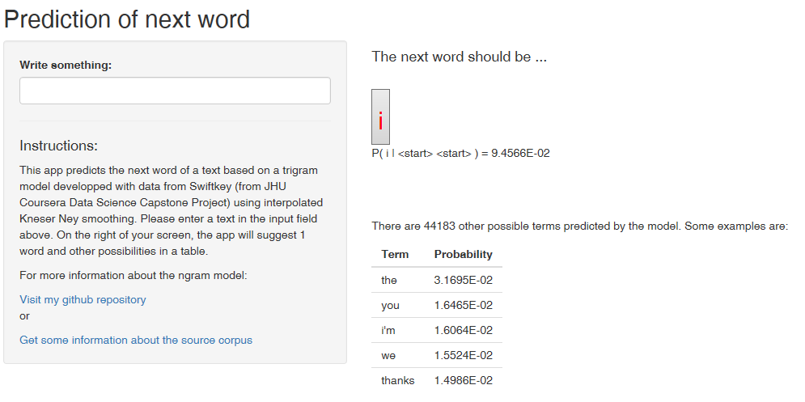
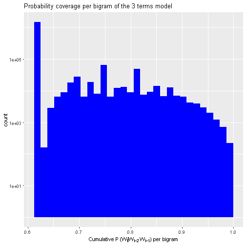
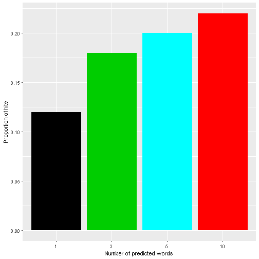

Next word using a ngram model
========================================================
author: Pablo O Rodriguez
date: Mon Jun 19 00:19:49 2017
autosize: true

Summary
========================================================
This presentation objective is to explain the utilization and the background of my [next word prediction](https://porbm28.shinyapps.io/next_word_prediction/) shiny app.  
Content:
- Using the [next word prediction](https://porbm28.shinyapps.io/next_word_prediction/) shiny app  
- Ngram model description
- Evaluation of the model performance  

Using the app
========================================================
class::small-code

***
- Right panel: is where the testing text should be introduced. With text entry, prediction occurs simultaneously. Reference to the [ngram model repository](https://github.com/pablorodrig16/JHUCapstoneProject) and to my [milestone report](https://rpubs.com/pablo_rodriguez/MilestoneReport) are included.  
- Left Panel: displays the result. In red the word with the highest probability $(P (w~i~|w~i-2~w~i-1~))$ according to the entry text and the conditional probability. Below, some other possible words in decreasing order of $(P (w~i~|w~i-2~w~i-1~))$.  

Ngram model description
========================================================
Full description of the code can be found [here](https://github.com/pablorodrig16/JHUCapstoneProject/blob/master/processing_ngram_models.md).   

***
- `quanteda` and `data.table` packages were used.  
- A sample of 30% the documents were obtained (95% for training the model).  
- First documents were tokenized to sentences and the start and the of each sentece was tagged with an special token.  
- Then 1, 2 and 3 terms ngrams were extracted and interpolated Kneyer-Ney smoothing (see [Jurafsky and Martin](https://web.stanford.edu/~jurafsky/slp3/)) was used to order the terms. Rare terms (frequency less than 3) were prunned.  
- In order to predict the next word, the app searchs in ngrams table of 3 terms. If no hit then looks in 2 terms. If no hit, it picks up the term with the highest $P~continuation~$.  

Model performance evaluation
========================================================

Using test data from 'news' documents, the plot shows the probability of success of the model (using different number of predicted words) for predicting the next word following a bigram:  
***

